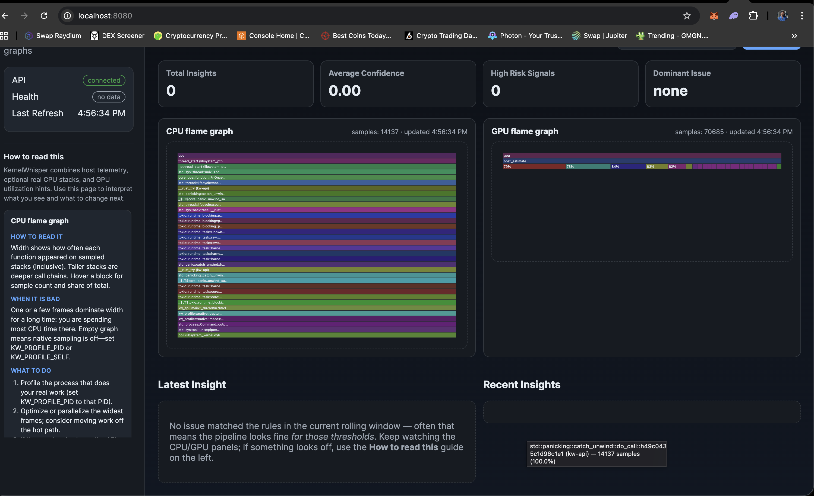
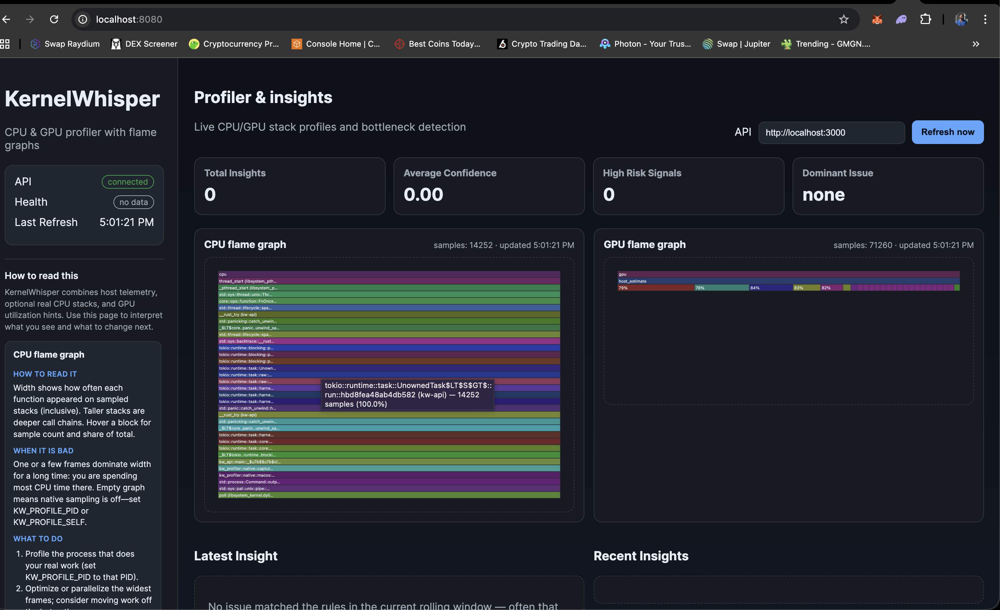
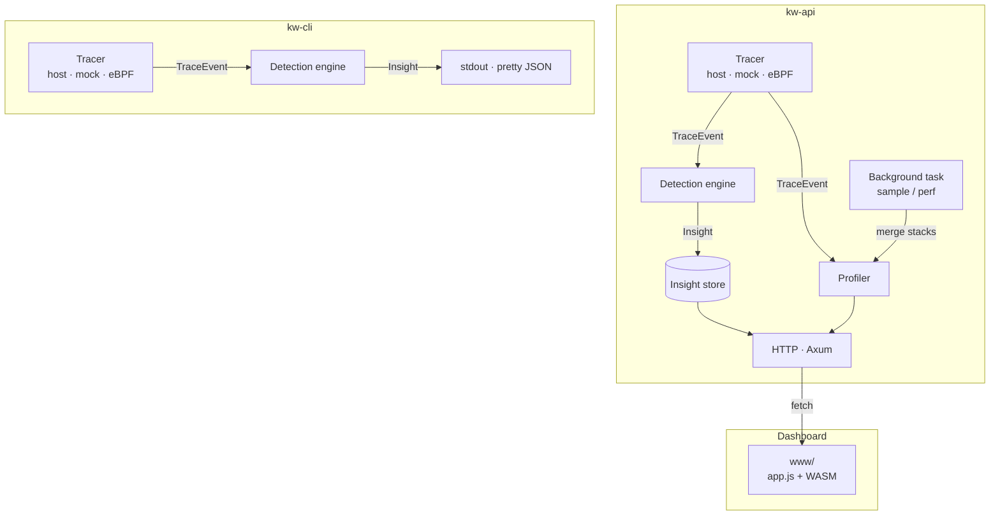

# KernelWhisper

**KernelWhisper** helps you see whether your **host** (CPU, I/O, Python, dataloaders) is starving your **GPU**, and points you at **what to change next**—with a live dashboard, structured insights, optional **CPU flame graphs**, and a small HTTP API.

It is built for teams shipping **accelerator-backed workloads** (ML training, inference, HPC-style pipelines) who need a fast answer to: *“Is this slow because of the GPU, or because we’re not feeding it?”*

### Dashboard





---

## Who it’s for

- **ML / performance engineers** tuning training or inference pipelines  
- **Backend developers** running services that depend on GPUs  
- Anyone who wants **one place** that combines coarse **host telemetry**, **GPU utilization** (when NVIDIA tools are available), and **actionable copy**—not only raw metrics

---

## What problem it solves

| Situation | How KernelWhisper helps |
|-----------|-------------------------|
| GPU utilization is low but the machine feels busy | Surfaces **CPU vs GPU** patterns and explains them in plain language |
| You don’t know *where* CPU time goes | Optional **native CPU stacks** (`sample` on macOS, `perf` on Linux) merged into a **flame-style tree** for the process you choose |
| Your team reads dashboards differently | **Playbook** + insight fields (**what the data shows**, **why it matters**, **what to do**) reduce misinterpretation |
| You want to wire this into other tools | **JSON API** for health, insights, flame profiles, and playbook; **CLI** for a continuous **insight-only** JSON stream |

---

## What you get (product surfaces)

1. **Web dashboard** — Flame-style CPU/GPU panels, insight cards, metrics, and an in-app **“How to read this”** guide (from `/v1/playbook`).  
2. **Insights** — Rule-based detections (e.g. CPU-heavy + low GPU, I/O pressure, GPU underfed) with **confidence**, **data summary**, **impact**, and **numbered suggestions**.  
3. **API** — `GET /health`, `/v1/insights`, `/v1/profile/cpu`, `/v1/profile/gpu`, `/v1/playbook`.  
4. **CLI** — Same tracer + engine as the API, but prints **pretty-printed insight JSON to stdout** only (no HTTP, no stored history, no flame/playbook). See [CLI](#cli).

---

## Limitations (read this)

KernelWhisper is **purpose-built**, not a general observability platform. You should know what it **does not** do:

- **Not full APM** — No distributed tracing, log aggregation, or hosted metrics backend (e.g. Prometheus/Grafana) out of the box.  
- **Not a GPU kernel profiler** — The GPU view is **utilization-oriented** (from `nvidia-smi` when available, plus a small tree), not Nsight / rocprof-style **kernel timelines** or shader-level analysis.  
- **Not a concurrency debugger** — It does not detect data races, deadlocks, or lock contention; high runnable/blocked counts are **coarse** hints only.  
- **CPU stacks are local to the API host** — `sample` / `perf` run **on the machine where `kw-api` runs**, for **one PID** you configure. Profiling a remote box means running the API **on** (or next to) that workload, or tunneling HTTP—not “profile arbitrary remote PID from your laptop” without deployment.  
- **`KW_PROFILE_SELF=1` profiles the API** — Great for demos; for real work, set **`KW_PROFILE_PID`** to your **training/inference** process on the same host.  
- **Host metrics are coarse** — Default **host** mode uses **`ps`**-style signals (plus optional Linux **eBPF**). This is good for direction, not kernel-level precision everywhere.  
- **Insight thresholds are code-defined** — Detection rules and numeric cutoffs live in **`crates/engine`** today (not a long list of `KW_*` tuning env vars).  
- **Mock tracer** — `KW_TRACER_MODE=mock` is for demos/tests; use **host** (+ optional **`KW_TRACER_NO_MOCK=1`**) when you want real signals.

---

## Quick start

**Prerequisites:** Rust, [`wasm-pack`](https://rustwasm.github.io/wasm-pack/installer/) (`cargo install wasm-pack`), Python 3.

```bash
make ui-build
make dev
```

Open **http://localhost:8080** and keep the default API URL **http://localhost:3000**.

**Stronger “real” defaults** (host tracer, no mock fallback, CPU sampling of the API process for a quick flame demo):

```bash
make ui-build
make dev-real
```

---

### `make ui-build` fails: E0463 / `rustversion` / `rustversion_compat`

`wasm-bindgen`’s build script needs the **`rustversion`** crate. A bad or partial `~/.cargo/registry` cache usually causes this.

```bash
rustup update stable
cd /path/to/kernelwhisper
rm -rf ~/.cargo/registry/src/index.crates.io-*/wasm-bindgen-0.2.114
rm -f ~/.cargo/registry/cache/index.crates.io-*/wasm-bindgen-0.2.114.crate
cargo fetch
cargo clean
make ui-build
```

If it still fails, reset the registry (re-downloads on next build):

```bash
rm -rf ~/.cargo/registry/cache ~/.cargo/registry/src
cargo fetch
make ui-build
```

---

## Configuration: real CPU stacks & GPU signal

| Variable | Effect |
|----------|--------|
| `KW_TRACER_NO_MOCK=1` | Do not fall back to the mock tracer if host/eBPF fails (startup error instead). |
| `KW_PROFILE_PID=<pid>` | CPU profile from **native stacks** for that PID (`sample` on macOS, `perf` on Linux). |
| `KW_PROFILE_SELF=1` | Profile the **`kw-api` process** (demo / self-check; not your training job). |
| `KW_PROFILE_INTERVAL_MS` | How often to capture CPU stacks (default `2500`). |
| `KW_PROFILE_SAMPLE_SECS` | Duration passed to `sample` / `perf sleep` (default `0.2`, max `60`). |

**GPU %:** If **`nvidia-smi`** is on `PATH`, host mode uses **real** `utilization.gpu`. Otherwise the value is a **host-side estimate** from CPU load (labeled in telemetry and insights).

---

## API (quick reference)

| Method | Path | Purpose |
|--------|------|---------|
| GET | `/health` | Liveness |
| GET | `/v1/insights` | Recent insights (JSON array) |
| GET | `/v1/profile/cpu` | Merged CPU stack tree for the flame UI |
| GET | `/v1/profile/gpu` | Shallow GPU / utilization tree |
| GET | `/v1/playbook` | Static guide JSON for the dashboard |

```bash
curl http://localhost:3000/health
curl http://localhost:3000/v1/insights
curl http://localhost:3000/v1/profile/cpu
curl http://localhost:3000/v1/playbook
```

**Insight issues** today include `cpu_bottleneck`, `io_pressure`, and `gpu_underfed`. Each item includes `data_summary`, `impact_summary`, `suggestions`, and `confidence`.

---

## CLI

`kw-cli` runs the **same** `start_from_env` tracer and **`DetectionEngine`** as the API, but **only** emits insights to the terminal.

| | **CLI (`kw-cli`)** | **API (`kw-api`)** |
|--|-------------------|---------------------|
| Insights | Yes — one pretty-printed JSON object per detection (stdout) | Yes — `GET /v1/insights` (last N stored in memory) |
| CPU / GPU flame JSON | No | Yes — `/v1/profile/cpu`, `/v1/profile/gpu` |
| Playbook | No | Yes — `/v1/playbook` |
| Native `sample` / `perf` | No — CLI does not run the profiler | Yes — when `KW_PROFILE_PID` or `KW_PROFILE_SELF` is set on the API |
| Persistence | None | In-memory ring of insights |

**Examples:**

```bash
# Default tracer (host, with mock fallback if host fails)
cargo run -p kw-cli

# Deterministic demo signal
KW_TRACER_MODE=mock cargo run -p kw-cli

# Host only (explicit)
make cli-host
```

Use **curl** or the **dashboard** for flame graphs and the reading guide; use the **CLI** for quick pipelines (e.g. `jq`, logging, CI smoke tests on insight shape).

---

## Makefile

`make help` lists targets. Common ones:

- `make api` / `make api-mock` / `make api-host` — API only  
- `make ui-build` — Build WASM into `crates/ui-wasm/www/pkg`  
- `make ui` — Serve dashboard on port 8080  
- `make dev` — API + dashboard  
- `make dev-real` — Like `dev`, plus `KW_TRACER_NO_MOCK=1` and `KW_PROFILE_SELF=1`  
- `make clean` — `cargo clean`

---

## Tracing modes

| Mode | Behavior |
|------|----------|
| `host` (default) | Live signals from **`ps`** (+ optional **`nvidia-smi`** for GPU %) |
| `mock` | Synthetic stream for demos/tests |
| `ebpf` | Linux-only tracepoints via **`aya`** (see `crates/tracer/ebpf`) |

```bash
./crates/tracer/ebpf/build-ebpf.sh   # Linux: build eBPF object
KW_TRACER_MODE=ebpf cargo run -p kw-api
```

---

## Architecture

### Flow

Data moves through the system in two **separate processes**: the API owns profiling and HTTP; the CLI reuses only tracer + engine.



---

## Container

```bash
docker compose up --build api
```

Optional ClickHouse profile:

```bash
docker compose --profile clickhouse up --build
```

---

## JSON shapes (reference)

**Flame profile (CPU)** — inclusive counts per node; CPU tree is empty until `KW_PROFILE_PID` or `KW_PROFILE_SELF` is set.

```json
{
  "kind": "cpu",
  "total_samples": 1204,
  "updated_at": "2025-03-22T12:00:00Z",
  "root": { "name": "cpu", "value": 1204, "children": [] }
}
```

**Insight**

```json
{
  "issue": "cpu_bottleneck",
  "confidence": 0.87,
  "message": "Host CPU is saturated while GPU utilization stays low …",
  "data_summary": "Across the last 20 samples …",
  "impact_summary": "The accelerator is idle relative to demand …",
  "suggestions": ["Batch more work per launch …"],
  "ts": "2025-03-22T12:00:00Z"
}
```
